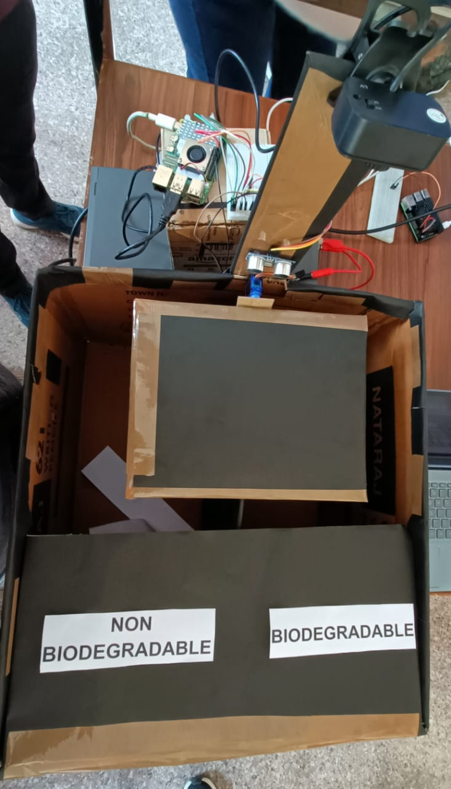
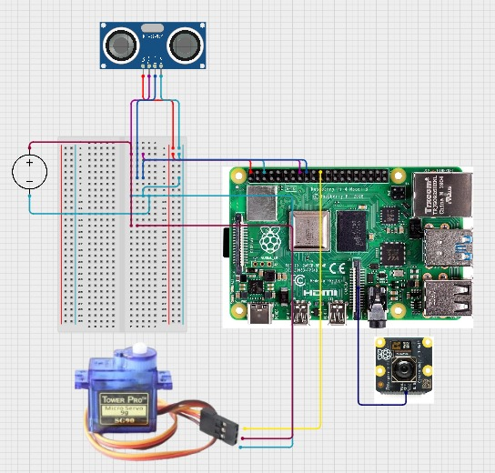

# ♻️ SmartSort - IoT Smart Waste Segregation Bin

A smart, automated waste management system that uses **Computer Vision** and **IoT** to segregate waste into **Biodegradable** and **Non-Biodegradable** categories. Powered by a Raspberry Pi 4 and a custom TensorFlow Lite model.



## 📋 Project Overview
This project solves the problem of improper waste disposal at the source. The bin operates autonomously using a "Sense-Think-Act" pipeline:
1.  **Sense:** An ultrasonic sensor detects when waste is thrown.
2.  **Think:** A camera captures an image, and a TFLite model classifies it (Bio vs. Non-Bio).
3.  **Act:** A servo motor tilts a flap to direct the waste into the correct compartment.

## 🛠️ Hardware Requirements
* **Raspberry Pi 4** (4GB or 8GB RAM recommended)
* **Raspberry Pi Camera Module/USB Webcam** 
* **HC-SR04 Ultrasonic Sensor**
* **SG90 Micro Servo Motor**
* **External Power Supply** for the Servo
* Jumper wires & Breadboard
* Cardboard/Acrylic chassis for the bin

## ⚙️ Circuit Diagram
The servo motor is powered externally to prevent voltage drops on the Raspberry Pi.



**Wiring Pinout:**
| Component | Pin | Raspberry Pi Pin |
| :--- | :--- | :--- |
| **Ultrasonic Trig** | `Trig` | GPIO 23 |
| **Ultrasonic Echo** | `Echo` | GPIO 24 |
| **Servo Signal** | `Signal` | GPIO 18 |
| **USB Camera** | USB | Any USB Port |

*Note: The Servo VCC/GND are connected to the external battery pack, sharing a common ground with the Pi.*

## 💻 Software & Dependencies

The project runs on **Raspberry Pi OS** (RasPiOS).

### Prerequisites
* Python 3.7+
* TensorFlow Lite Runtime
* OpenCV
* GPIO Zero

## 🚀 How to Run

1.  **SSH into your Raspberry Pi:**
    ```bash
    ssh pi@<YOUR_PI_IP_ADDRESS>
    ```

2.  **Navigate to the project directory:**
    ```bash
    cd Smart-Waste-Bin
    ```
3.  **Add the scripts:**
    ```bash
    # Transfer the Python script
    scp testing.py pi@<YOUR_PI_IP>:/home/pi/Smart-Waste-Bin/

    # Transfer the Model file
    scp waste_classifier_model_quantized.tflite pi@<YOUR_PI_IP>:/home/pi/Smart-Waste-Bin/
    ```

4.  **Run the script:**
    ```bash
    python3 testing.py
    ```

## 🔄 How the Prototype Runs

Once the script is running, the system follows this autonomous workflow:

1.  **Initialization:** The script initializes the camera and moves the servo motor to the **Neutral (Center)** position.
2.  **Waiting for Input:** The Ultrasonic Sensor continuously monitors for objects. The terminal will display "Waiting...".
3.  **Detection:** When you bring an object (waste) close to the sensor (within 20cm), the system triggers.
4.  **Capture & Classification:** The camera wakes up, captures a single frame, and sends it to the TFLite model. The prediction (Bio/Non-Bio) is printed in the terminal.
5.  **Actuation:**
    * If **Biodegradable**: The servo tilts the flap to the **Left**.
    * If **Non-Biodegradable**: The servo tilts the flap to the **Right**.
6.  **Reset:** The system holds the position for 3 seconds to allow the waste to fall, then resets the flap to **Neutral** and waits 5 seconds before scanning again.

## 🧠 Model Training

The model was trained using a custom dataset of household waste.

  * **Classes:** Biodegradable, Non-Biodegradable
  * **Algorithm:** SSD MobileNet V2 / YOLO (Specify which one you used)
  * **Format:** Converted to `.tflite` for edge optimization.

## 👨‍💻 Contributors

- **Prabhkirat Kaur** 
- **Sangeet Sangwan** 
- **Shubham Gupta** 
- **Vikas Prajapati** 

